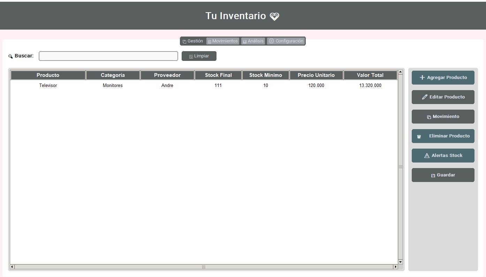
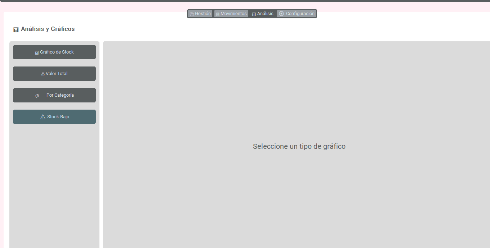
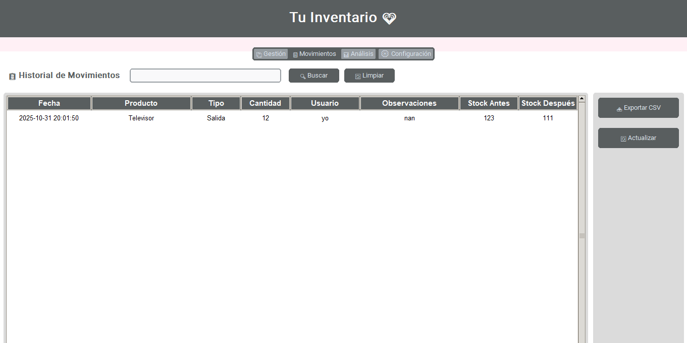

## 📖 Sobre el Proyecto

Sistema de inventario completo desarrollado en Python que permite gestionar productos, registrar movimientos de stock, generar reportes visuales y mantener backups automáticos. Diseñado con una interfaz moderna usando CustomTkinter para ofrecer la mejor experiencia de usuario.

**¿Por qué este proyecto?**
- Solución práctica para pequeños y medianos negocios
- Interfaz moderna y fácil de usar
- Análisis visual de datos en tiempo real
- Sistema de respaldos automáticos
- 100% gratuito y de código abierto

---

## ✨ Características Principales

### 🎯 Gestión Completa de Productos

<table>
<tr>
<td width="50%">

**Operaciones Básicas**
- Agregar productos nuevos
- Editar información existente
- Eliminar con confirmación
- Búsqueda instantánea
- Vista detallada completa

</td>
<td width="50%">

**Información del Producto**
- Nombre y descripción
- Categoría y proveedor
- Stock inicial/final
- Precio unitario
- Stock mínimo configurable

</td>
</tr>
</table>

###  Control de Inventario

- **Registro de Entradas**: Aumenta el stock con trazabilidad completa
- **Registro de Salidas**: Control de ventas con validación automática
- **Alertas Inteligentes**: Notificaciones cuando el stock está bajo
- **Cálculos Automáticos**: Valor total del inventario actualizado
- **Trazabilidad**: Seguimiento por usuario y fecha

### 📊 Análisis Visual

| Gráfico | Descripción |
|---------|-------------|
| **Stock por Producto** | Top 20 productos con mayor inventario |
| **Valor Total** | Ranking de productos por valor monetario |
| **Por Categoría** | Distribución del stock en categorías |
| **Stock Bajo** | Comparativa visual de productos críticos |

### 📋 Historial Completo

- Registro cronológico de todos los movimientos
- Búsqueda avanzada en el historial
- Exportación a CSV para Excel
- Observaciones detalladas por operación
- Timestamps exactos de cada transacción

### Seguridad y Respaldos

-  **Backups Automáticos**: Antes de cada guardado
-  **Backups Manuales**: Cuando lo necesites
-  **Gestión de Backups**: Elimina respaldos antiguos
-  **Formato Excel**: Compatible con Office y LibreOffice
-  **Acceso Rápido**: Botón directo a la carpeta de datos

---

##  Instalación

### Requisitos del Sistema

-  Python 3.8 o superior
-  Windows, macOS o Linux
-  pip (incluido con Python)

### Instalación Rápida

```bash
# 1. Clona el repositorio
git clone https://github.com/RosaFg/inventario-sistema.git

# 2. Navega al directorio
cd inventario-sistema

# 3. Instala las dependencias
pip install -r requirements.txt

# 4. ¡Ejecuta la aplicación!
python Inventario.py
```

### Instalación Manual de Dependencias

Si prefieres instalar cada librería individualmente:

```bash
pip install customtkinter>=5.0.0
pip install pandas>=1.5.0
pip install openpyxl>=3.0.0
pip install matplotlib>=3.5.0
```

---

## 💻 Uso

### 🎬 Inicio Rápido

#### 1. Agregar tu Primer Producto

```
📦 Gestión → ➕ Agregar Producto
```

1. Completa el nombre del producto (obligatorio)
2. Agrega categoría y proveedor (opcional)
3. Define stock inicial y precio
4. Establece un stock mínimo (opcional)
5. ¡Guarda y listo!

#### 2. Registrar Movimientos

```
📦 Gestión → Selecciona producto → 📦 Movimiento
```

- **Entrada**: Aumenta el stock (compras, devoluciones)
- **Salida**: Reduce el stock (ventas, pérdidas)
- El sistema valida automáticamente el stock disponible

#### 3. Visualizar Análisis

```
📊 Análisis → Selecciona tipo de gráfico
```

- Visualiza el stock en tiempo real
- Identifica productos más valiosos
- Analiza distribución por categorías
- Detecta productos con stock crítico

### 🔍 Funciones Avanzadas

| Acción | Descripción |
|--------|-------------|
| **Doble clic** en producto | Ver todos los detalles |
| **Búsqueda en tiempo real** | Filtra mientras escribes |
| **Exportar movimientos** | CSV para análisis en Excel |
| **Backups automáticos** | Se crean al guardar |
| **Alertas de stock** | Notificación visual |

---

## 📸 Capturas de Pantalla

### Gestión de Inventario

*Interfaz principal con tabla de productos, búsqueda en tiempo real y panel de acciones*

### Análisis y Gráficos

*Visualización de datos con múltiples tipos de gráficos estadísticos*

### Historial de Movimientos

*Registro completo de todas las operaciones con búsqueda avanzada*

---

##  Estructura del Proyecto

```
inventario-sistema/
│
├── 📄 Inventario.py        # Aplicación principal
├── 📋 requirements.txt          # Dependencias del proyecto
├── 📖 README.md                 # Documentación (este archivo)
├── 📜 LICENSE                   # Licencia MIT
├── 🚫 .gitignore               # Archivos ignorados por Git
│
├── 📸 screenshots/             # Capturas de pantalla
│   ├── gestion.png
│   ├── analisis.png
│   └── movimientos.png
│
└── 💾 data/                    # Datos (generado automáticamente)
    ├── Inventario2.0.xlsx      # Base de datos principal
    └── Inventario2.0_bak_*.xlsx # Backups automáticos
```

---

##  Personalización

### Cambiar los Colores

Edita el diccionario `COLORS` en `inventario_ctk.py`:

```python
COLORS = {
    "primary": "#595E5F",      # Color principal
    "secondary": "#595E5F",    # Color secundario
    "accent": "#595E5F",       # Color de acento
    "bg": "#FFF0F5",          # Color de fondo
    "hover": "#4F6B72",       # Color hover botones
    "success": "#4F6B72",     # Color de éxito
    "warning": "#4F6B72",     # Color de advertencia
    "danger": "#4F6B72"       # Color de peligro
}
```

### Cambiar el Título

```python
self.title("Tu Inventario 💗")  # Línea ~480
```

### Cambiar Tema (Claro/Oscuro)

```python
ctk.set_appearance_mode("light")  # o "dark" para tema oscuro
```

---

## 🔧 Solución de Problemas

<details>
<summary><b>❌ Error: "No module named 'customtkinter'"</b></summary>

**Solución:**
```bash
pip install customtkinter
```
</details>

<details>
<summary><b>❌ Error: "No module named 'openpyxl'"</b></summary>

**Solución:**
```bash
pip install openpyxl
```
</details>

<details>
<summary><b>❌ El archivo Excel no se crea</b></summary>

**Causas posibles:**
1. No tienes permisos de escritura en la carpeta
2. Otro programa está usando el archivo
3. Antivirus bloqueando la creación

**Solución:**
- Ejecuta como administrador
- Cierra Excel si está abierto
- Agrega excepción en el antivirus
</details>

<details>
<summary><b>❌ Los gráficos no se muestran</b></summary>

**Solución:**
```bash
pip install --upgrade matplotlib
```
</details>

<details>
<summary><b>❌ Error de formato de números</b></summary>

**Solución:** Asegúrate de usar punto (.) como separador decimal, no coma (,)
</details>

---

## 🤝 Contribuciones

¡Las contribuciones son bienvenidas! Si quieres mejorar este proyecto:

1.  Fork el repositorio
2.  Crea una rama: `git checkout -b feature/MiNuevaCaracteristica`
3.  Commit: `git commit -m 'Agregar nueva característica'`
4.  Push: `git push origin feature/MiNuevaCaracteristica`
5.  Abre un Pull Request

### Ideas para Contribuir

-  Reportar bugs
-  Sugerir nuevas características
-  Mejorar la documentación
-  Agregar traducciones
-  Mejorar el diseño

---

## 📝 Roadmap

### Versión 2.0 (Próximamente)
- [ ]  Exportar reportes a PDF
- [ ]  Modo oscuro completo
- [ ]  Diseño responsive mejorado
- [ ]  Notificaciones del sistema

### Versión 2.5 (Futuro)
- [ ]  Dashboard con métricas en tiempo real
- [ ]  Sistema de autenticación
- [ ]  Soporte multi-usuario con roles
- [ ]  Alertas por email

### Versión 3.0 (Visión)
- [ ]  App móvil complementaria
- [ ]  Sincronización en la nube
- [ ]  Integración con código de barras
- [ ]  Predicción de stock con IA

---

##  Licencia

Este proyecto está bajo la Licencia MIT - ver el archivo [LICENSE](LICENSE) para más detalles.

Esto significa que puedes:
- ✅ Usar comercialmente
- ✅ Modificar el código
- ✅ Distribuir
- ✅ Uso privado

---

## 👤 Autor

**Rosa Fuentes**

- 💼 GitHub: [@rosafg](https://github.com/RosaFg)
- 💼 LinkedIn: [Rosa Fuentes](https://linkedin.com/in/rosafg)
- 📧 Email: rosafuegos@gmail.com

---

## 🙏 Agradecimientos

- [CustomTkinter](https://github.com/TomSchimansky/CustomTkinter) - Por la increíble librería de UI moderna
- [Pandas](https://pandas.pydata.org/) - Por el potente manejo de datos
- [Matplotlib](https://matplotlib.org/) - Por las visualizaciones profesionales
- [OpenPyXL](https://openpyxl.readthedocs.io/) - Por la integración con Excel

---

## 📊 Estadísticas del Proyecto


---

<div align="center">

### ⭐ Si este proyecto te fue útil, considera darle una estrella ⭐

### 💡 ¿Tienes preguntas? [Abre un issue](https://github.com/RosaFg/inventario-sistema/issues)

--

Hecho con 💗 por Rosa-FG

</div>